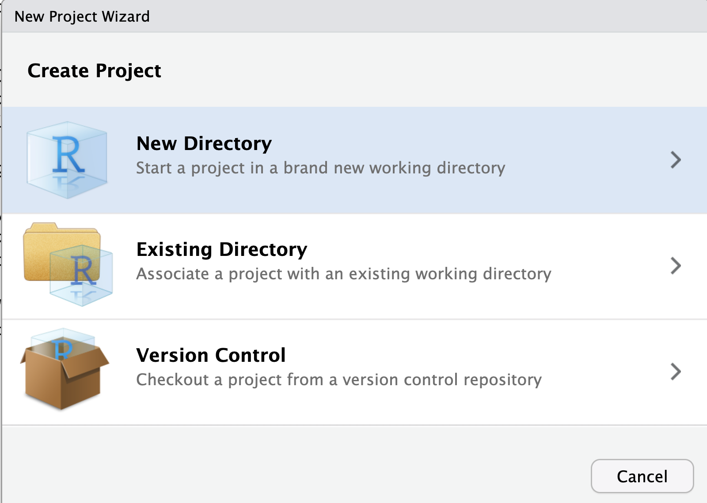
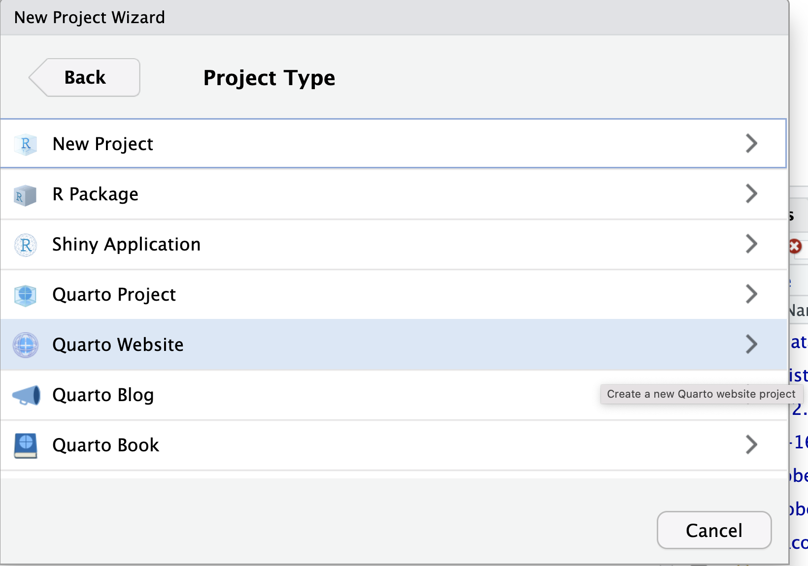
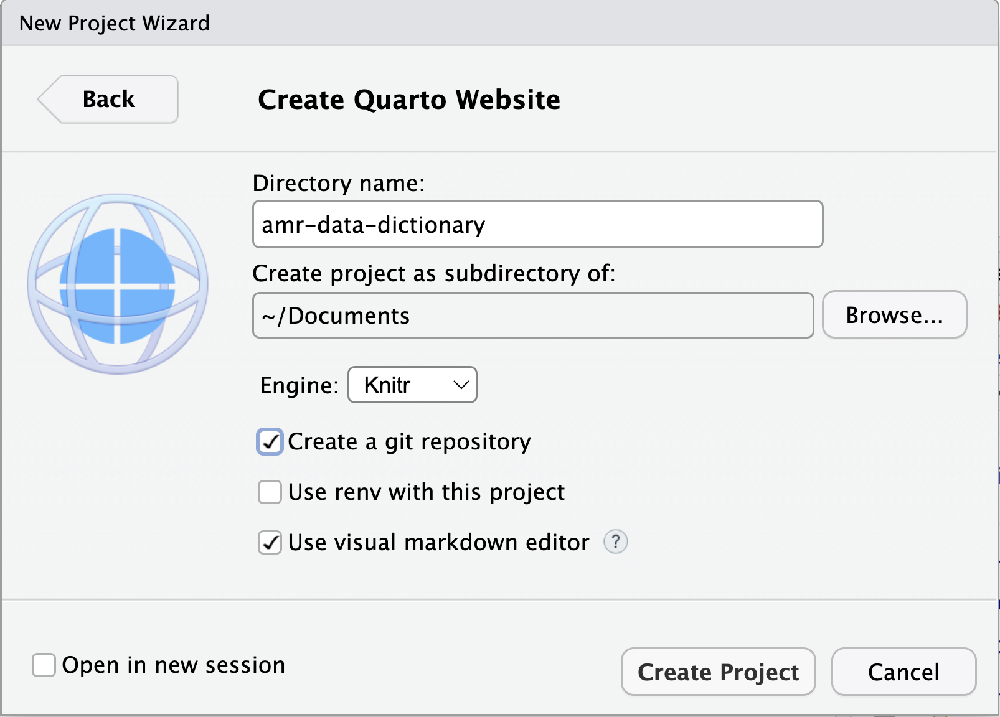
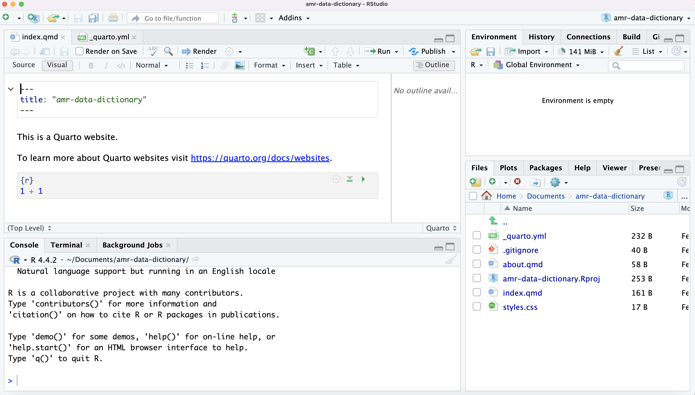
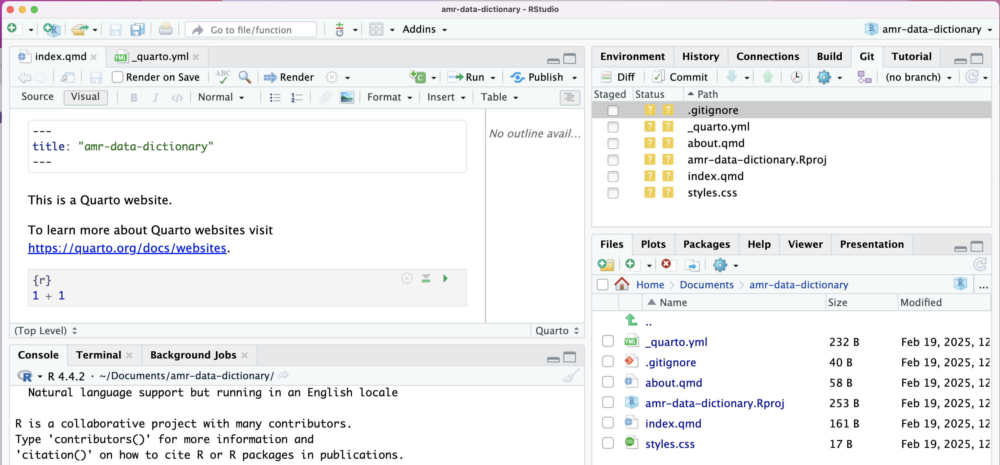
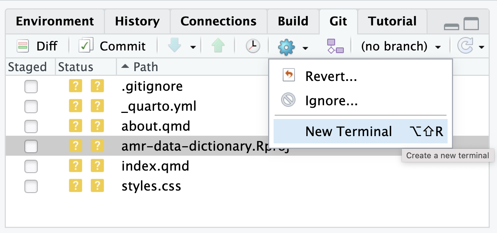
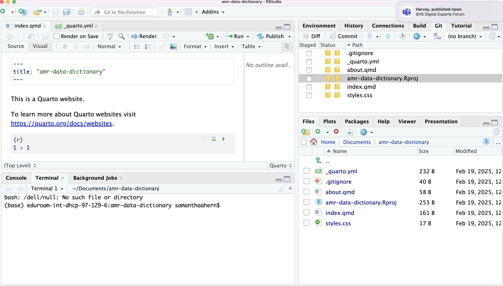

::::::::::::::::::::::::::::::::::::::: objectives

- Create a local Git repository from within RStudio.
- Describe the purpose of the `.git` directory.

::::::::::::::::::::::::::::::::::::::::::::::::::

:::::::::::::::::::::::::::::::::::::::: questions

- Where does Git store information?

::::::::::::::::::::::::::::::::::::::::::::::::::

Version control can be very useful when developing data analysis scripts. For
that reason, the popular development environment
[RStudio][rstudio] for the R programming language has built-in
integration with Git. While some advanced Git features still require the
command-line, RStudio has a nice interface for many common Git operations.

RStudio allows us to create a [project][rstudio-projects] associated with a
given directory to keep track of various related files. To be able to track the development of the project over time, to be able to revert to previous versions, and to collaborate with others, we version control the RStudio project with Git.

To get started using Git in RStudio, we create a new project:

{alt='RStudio screenshot showing the file menu dropdown with "New Project..." selected'}

This opens a dialog asking us how we want to create the project. We have
some options here. Let's say that we want to use RStudio to create a new project that we will track using Git. We will select "New Directory":

{alt='RStudio screenshot showing New Project dialog window with "New Directory" selected'}

The New Project wizard requires us to select which type of project we want to create. In this instance we want to create a data dictionary. We will select "Quarto Website":

{alt='RStudio screenshot showing New Project dialog window with "Quarto Website" selected'}

In the New Project Wizard we will now add the details of our project:
- Directory name: amr-data-dictionary, this is the name of our project
- We will use our Documents folder as the parent directory
- Check the Create a git repository box

{alt='RStudio screenshot showing New Project wizard dialog window with the Directory name added and the Create a git repository box checked'}

Click on 'Create Project'.

This will create a Quarto Website project and instantiate your directory with some files. Some of these relate to Quarto, others to Git.

{alt='RStudio screenshot showing the files automatically added to the amr-data-dictionary directory'}

We have initiated a git repository within the amr-data-dictionay directory.

This repository can include subdirectories and their files---there is no need to create
separate repositories nested within the `amr-data-dictionary` repository, whether
subdirectories are present from the beginning or added later. 

## Knowing where your repo is

When we specify that we want to create a git repository when setting up a new project within RStudio, the git repository is located in the directory we specify as part of the project creation.

When a repository is instantiated a .git directory is created. This is a hidden directory and is not viewable via a GUI file viewer, but it is visible from the command line.

If we were using bash, we would use `ls` to show the contents of our 'amr-data-dictionary' directory:

```bash
$ ls
```
This shows the same as our GUI file viewer.
But if we add the `-a` flag to show everything,
we can see that Git has created a hidden directory within `amr-data-dictionary` called `.git`:

```bash
$ ls -a
```

```output
.	..	.git
```

The full list of files for our 'amr-data-dictionary' directory will be:

```output
.				
..				
.Rproj.user
.git
.gitignore
_quarto.yml	
about.qmd
amr-data-dictionary.Rproj
index.qmd
styles.css
```
Git uses this special subdirectory to store all the information about the project,
including the tracked files and sub-directories located within the project's directory.
If we ever delete the `.git` subdirectory,
we will lose the project's history.

## Knowing the status of our repo

As we have created a Git repository, some extra items have appeared in our RStudio interface.

There is now a Git tab in the upper right panel of RStudio interface and a Git drop-down menu has been added to the toolbar.

{alt='RStudio screenshot showing updated interface with Git features'}

Focusing on the Git tab in the upper right panel, we can view the status of our files.

In addition, we can open a terminal from within the panel, by clicking on the settings wheel and selcted 'New Terminal':

{alt='RStudio screenshot showing updated interface with Git features'}

A terminal window will now appear as lower left pane.
The file path shows that we are in the amr-data-dictionary directory. 

{alt='RStudio screenshot showing terminal in lower left pane'}

As this is also the location of our repository we can now start using one of the most important git commands, which is particularly helpful to beginners. `git status` tells us the status of our project, and better, a list of changes in the project and options on what to do with those changes. We can use it as often as we want, whenever we want to understand what is going on.

```bash
$ git status
```

```output
On branch main

No commits yet

Untracked files:
  (use "git add <file>..." to include in what will be committed)
        .gitignore
        _quarto.yml
        about.qmd
        amr-data-dictionary.Rproj
        index.qmd
        styles.css

nothing to commit (create/copy files and use "git add" to track)
```

If you are using a different version of `git`, the exact
wording of the output might be slightly different.

:::::::::::::::::::::::::::::::::::::::  challenge

## Places to Create Git Repositories

Along with tracking information about our AMR data (the project we have already created),
Alfredo would also like to track information about antibiotics specifically.
Alfredo creates a `antibiotics` project inside his `amr-data-dictionary`
project with the following sequence of commands:

```bash
$ cd ~/Desktop    # return to Desktop directory
$ cd amr-data-dictionary      # go into amr-data-dictionary directory, which is already a Git repository
$ ls -a           # ensure the .git subdirectory is still present in the amr-data-dictionary directory
$ mkdir antibiotics # make a sub-directory amr-data-dictionary/antibiotics
$ cd antibiotics    # go into antibiotics subdirectory
$ git init        # make the antibiotics subdirectory a Git repository
$ ls -a           # ensure the .git subdirectory is present indicating we have created a new Git repository
```

Is the `git init` command, run inside the `antibiotics` subdirectory, required for
tracking files stored in the `antibiotics` subdirectory?

:::::::::::::::  solution

## Solution

No. Alfredo does not need to make the `antibiotics` subdirectory a Git repository
because the `amr-data-dictionary ` repository will track all files, sub-directories, and
subdirectory files under the `amr-data-dictionary ` directory.  Thus, in order to track
all information about desserts, Alfredo only needed to add the `antibiotics` subdirectory
to the `amr-data-dictionary ` directory.

Additionally, Git repositories can interfere with each other if they are "nested":
the outer repository will try to version-control
the inner repository. Therefore, it's best to create each new Git
repository in a separate directory. To be sure that there is no conflicting
repository in the directory, check the output of `git status`. If it looks
like the following, you are good to go to create a new repository as shown
above:

```bash
$ git status
```

```output
fatal: Not a git repository (or any of the parent directories): .git
```

:::::::::::::::::::::::::

## Correcting `git init` Mistakes

Jimmy explains to Alfredo how a nested repository is redundant and may cause confusion
down the road. Alfredo would like to go back to a single git repository. How can Alfredo undo
his last `git init` in the `antibiotics` subdirectory?

:::::::::::::::  solution

## Solution -- USE WITH CAUTION!

### Background

Removing files from a Git repository needs to be done with caution. But we have not learned
yet how to tell Git to track a particular file; we will learn this in the next episode. Files
that are not tracked by Git can easily be removed like any other "ordinary" files with

```bash
$ rm filename
```

Similarly a directory can be removed using `rm -r dirname`.
If the files or folder being removed in this fashion are tracked by Git, then their removal
becomes another change that we will need to track, as we will see in the next episode.

### Solution

Git keeps all of its files in the `.git` directory.
To recover from this little mistake, Alfredo can remove the `.git`
folder in the antibiotics subdirectory by running the following command from inside the `amr-data-dictionary` directory:

```bash
$ rm -rf antibiotics/.git
```

But be careful! Running this command in the wrong directory will remove
the entire Git history of a project you might want to keep.
In general, deleting files and directories using `rm` from the command line cannot be reversed.
Therefore, always check your current directory using the command `pwd`.


:::::::::::::::::::::::::

::::::::::::::::::::::::::::::::::::::::::::::::::

:::::::::::::::::::::::::::::::::::::::: keypoints

- `git init` initializes a repository.
- Git stores all of its repository data in the `.git` directory.

::::::::::::::::::::::::::::::::::::::::::::::::::
