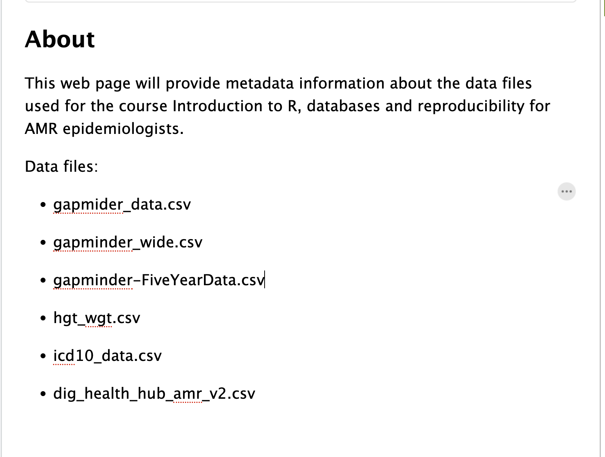
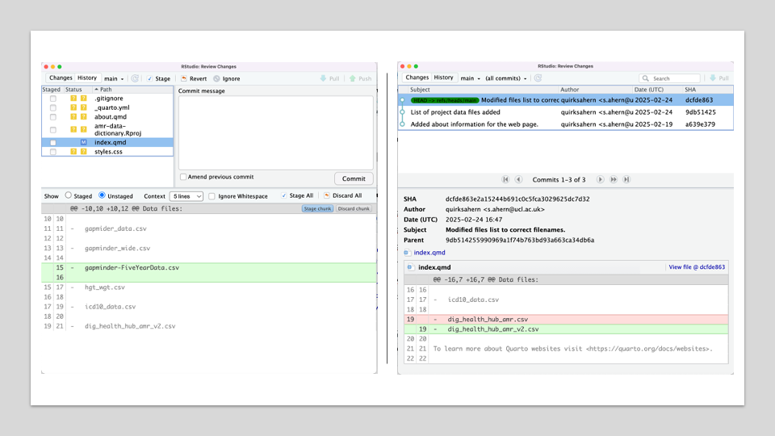

::::::::::::::::::::::::::::::::::::::: objectives

- Explain what the HEAD of a repository is and how to use it.
- Identify and use Git commit numbers.
- Compare various versions of tracked files.
- Restore old versions of files.

::::::::::::::::::::::::::::::::::::::::::::::::::

:::::::::::::::::::::::::::::::::::::::: questions

- How can I identify old versions of files?
- How do I review my changes?
- How can I recover old versions of files?

::::::::::::::::::::::::::::::::::::::::::::::::::

As we saw in the previous episode, we can refer to commits by their
identifiers.  You can refer to the *most recent commit* of the working
directory by using the identifier `HEAD`.

We've been adding small changes at a time to `index.qmd`, so it's easy to track our
progress by looking, so let's do that using our `HEAD`s.  Before we start,
let's make a change to `index.qmd`, adding yet another line.

We will add the data set gapminder-FiveYearData.csv to our existing list:

{alt='A screenshot showing the modified text of index.qmd'}

When we `Diff index.qmd`, we are comparing our change to our most recent commit, the `HEAD` automatically.

{alt='Combined screenshots showing chnages to index.qmd and that HEAD is referring to last commit'}

:::::::::::::::::::::::::::::::::::::::: callout

In addition to the GUI tools we are able to interact with Git via the `Terminal` from within RStudio.

If we chose to use the Terminal instead of the Diff button on the Git dropdown we would enter:

```bash
$ git diff HEAD index.qmd
```

```output
diff --git a/index.qmd b/index.qmd
index 7fa3dbf..b75dfaf 100644
--- a/index.qmd
+++ b/index.qmd
@@ -12,6 +12,8 @@ Data files:
 
 -   gapminder_wide.csv
 
+-   gapminder-FiveYearData.csv
+
 -   hgt_wgt.csv
 
 -   icd10_data.csv
```
which is the same as what you would get if you leave out `HEAD` (try it).  The
real goodness in all this is when you can refer to previous commits.  We do
that by adding `~1`
(where "~" is "tilde", pronounced [**til**\-d*uh*])
to refer to the commit one before `HEAD`.

```bash
$ git diff HEAD~1 index.qmd
```

If we want to see the differences between older commits we can use `git diff`
again, but with the notation `HEAD~1`, `HEAD~2`, and so on, to refer to them:

```bash
$ git diff HEAD~2 index.qmd
```

```output
diff --git a/index.qmd b/index.qmd
index 63c837f..b75dfaf 100644
--- a/index.qmd
+++ b/index.qmd
@@ -6,6 +6,20 @@ title: "amr-data-dictionary"
 
 This web page will provide metadata information about the data files used for the course Introduction to R, databases and reproducibility for AMR epidemiologists.
 
+Data files:
+
+-   gapmider_data.csv
+
+-   gapminder_wide.csv
+
+-   gapminder-FiveYearData.csv
+
+-   hgt_wgt.csv
+
+-   icd10_data.csv
+
+-   dig_health_hub_amr_v2.csv
+
```

We could also use `git show` which shows us what changes we made at an older commit as
well as the commit message, rather than the *differences* between a commit and our
working directory that we see by using `git diff`.

```bash
$ git show HEAD~2 index.qmd
```

```output
commit a639e379c5a198322add586e73414856369abddc
Author: quirksahern <s.ahern@ucl.ac.uk>
Date:   Wed Feb 19 15:49:50 2025 +0000

    Added about information for the web page.

diff --git a/index.qmd b/index.qmd
new file mode 100644
index 0000000..63c837f
--- /dev/null
+++ b/index.qmd
@@ -0,0 +1,13 @@
+---
+title: "amr-data-dictionary"
+---
+
+## About
+
+This web page will provide metadata information about the data files used for the course Introduction to R, databases and reproducibility for AMR epidemiologists.
+
+To learn more about Quarto websites visit <https://quarto.org/docs/websites>.
+
+```{r}
+1 + 1
+``
```

In this way,
we can build up a chain of commits.
The most recent end of the chain is referred to as `HEAD`;
we can refer to previous commits using the `~` notation,
so `HEAD~1`
means "the previous commit",
while `HEAD~123` goes back 123 commits from where we are now.

We can also refer to commits using
those long strings of digits and letters
that both `git log` and `git show` display.
These are unique IDs for the changes,
and "unique" really does mean unique:
every change to any set of files on any computer
has a unique 40-character identifier.
Our first commit was given the ID
`a639e379c5a198322add586e73414856369abddc`,
so let's try this:

```bash
$ git diff a639e379c5a198322add586e73414856369abddc index.qmd
```

```output
diff --git a/index.qmd b/index.qmd
index 63c837f..b75dfaf 100644
--- a/index.qmd
+++ b/index.qmd
@@ -6,6 +6,20 @@ title: "amr-data-dictionary"
 
 This web page will provide metadata information about the data files used for the course Introduction to R, databases and reproducibility for AMR epidemiologists.
 
+Data files:
+
+-   gapmider_data.csv
+
+-   gapminder_wide.csv
+
+-   gapminder-FiveYearData.csv
+
+-   hgt_wgt.csv
+
+-   icd10_data.csv
+
+-   dig_health_hub_amr_v2.csv
+
 To learn more about Quarto websites visit <https://quarto.org/docs/websites>.
```

That's the right answer,
but typing out random 40-character strings is annoying,
so Git lets us use just the first few characters (typically seven for normal size projects):

```bash
$ git diff a639e37 index.qmd
```

```output
diff --git a/index.qmd b/index.qmd
index 63c837f..b75dfaf 100644
--- a/index.qmd
+++ b/index.qmd
@@ -6,6 +6,20 @@ title: "amr-data-dictionary"
 
 This web page will provide metadata information about the data files used for the course Introduction to R, databases and reproducibility for AMR epidemiologists.
 
+Data files:
+
+-   gapmider_data.csv
+
+-   gapminder_wide.csv
+
+-   gapminder-FiveYearData.csv
+
+-   hgt_wgt.csv
+
+-   icd10_data.csv
+
+-   dig_health_hub_amr_v2.csv
+
 To learn more about Quarto websites visit <https://quarto.org/docs/websites>.
```
::::::::::::::::::::::::::::::::::::::::::::::::::


All right! 

So we can save changes to files and see what we've changed. Now, how
can we restore older versions of things?
Let's suppose we change our mind about the last update to
`index.qmd` ("gapminder-FiveYearData.csv").

`Diff index.qmd` shows us that the file has been changed,
but those changes haven't been staged:

{alt='Combined screenshots showing changes to index.qmd and that HEAD is referring to last commit'}

We can put things back the way they were
by selecting `Revert`:

{alt='RStuio screenshot of the Revert icon'}

As you might guess from its name,
`Revert` restores an old version of a file.

By default,
it recovers the version of the file recorded in `HEAD`,
which is the last saved commit.

:::::::::::::::::::::::::::::::::::::::: callout

If we want to go back even further, but we can only do this via the `Terminal`.

The command we will use is `git restore` with which we can use a commit identifier, using `-s` option:

```bash
$ git restore -s 9db51425 index.qmd
```

```bash
$ cat index.qmd
```

```output
---
title: "amr-data-dictionary"
---

## About

This web page will provide metadata information about the data files used for the course Introduction to R, databases and reproducibility for AMR epidemiologists.

Data files:

-   gapmider_data.csv

-   gapminder_wide.csv

-   hgt_wgt.csv

-   icd10_data.csv

-   dig_health_hub_amr.csv

To learn more about Quarto websites visit <https://quarto.org/docs/websites>.

```

```bash
$ git status
```

```output
On branch main
Changes not staged for commit:
  (use "git add <file>..." to update what will be committed)
  (use "git restore <file>..." to discard changes in working directory)
        modified:   index.qmd

Untracked files:
  (use "git add <file>..." to include in what will be committed)
        .gitignore
        _quarto.yml
        about.qmd
        amr-data-dictionary.Rproj
        styles.css

no changes added to commit (use "git add" and/or "git commit -a")

```

Notice that the changes are not currently in the staging area, and have not been committed. 
If we wished, we can put things back the way they were at the last commit by using `git restore` to overwrite
the working copy with the last committed version:

```bash
$ git restore index.qmd
$ cat index.qmd
```

```output
---
title: "amr-data-dictionary"
---

## About

This web page will provide metadata information about the data files used for the course Introduction to R, databases and reproducibility for AMR epidemiologists.

Data files:

-   gapmider_data.csv

-   gapminder_wide.csv

-   hgt_wgt.csv

-   icd10_data.csv

-   dig_health_hub_amr_v2.csv

To learn more about Quarto websites visit <https://quarto.org/docs/websites>.
```

It's important to remember that
we must use the commit number that identifies the state of the repository
*before* the change we're trying to undo.
A common mistake is to use the number of
the commit in which we made the change we're trying to discard.
In the example below, we want to retrieve the state from before the most
recent commit (`HEAD~1`), which is commit `9db51425`. We use the `.` to mean all files:

{alt='A diagram showing how git restore can be used to restore the previous version of two files'}

::::::::::::::::::::::::::::::::::::::::::::::::::

So, to put it all together,
here's how Git works in cartoon form:

{alt='A diagram showing the entire git workflow: local changes are staged using git add, applied to the local repository using git commit, and can be restored from the repository using git checkout'}

The fact that files can be reverted one by one
tends to change the way people organize their work.
If everything is in one large document,
it's hard (but not impossible) to undo changes to the introduction
without also undoing changes made later to the conclusion.
If the introduction and conclusion are stored in separate files,
on the other hand,
moving backward and forward in time becomes much easier.

:::::::::::::::::::::::::::::::::::::::  challenge

## Recovering Older Versions of a File

Jennifer has made changes to the Python script that she has been working on for weeks, and the
modifications she made this morning "broke" the script and it no longer runs. She has spent
\~ 1hr trying to fix it, with no luck...

Luckily, she has been keeping track of her project's versions using Git! Which commands below will
let her recover the last committed version of her Python script called
`data_cruncher.py`?

1. `$ git restore`

2. `$ git restore data_cruncher.py`

3. `$ git restore -s HEAD~1 data_cruncher.py`

4. `$ git restore -s <unique ID of last commit> data_cruncher.py`

5. Both 2 and 4

:::::::::::::::  solution

## Solution

The answer is (5)-Both 2 and 4.

The `restore` command restores files from the repository, overwriting the files in your working
directory. Answers 2 and 4 both restore the *latest* version *in the repository* of the file
`data_cruncher.py`. Answer 2 uses `HEAD` to indicate the *latest*, whereas answer 4 uses the
unique ID of the last commit, which is what `HEAD` means.

Answer 3 gets the version of `data_cruncher.py` from the commit *before* `HEAD`, which is NOT
what we wanted.

Answer 1 results in an error. You need to specify a file to restore. If you want to restore all files
you should use `git restore .`

:::::::::::::::::::::::::

::::::::::::::::::::::::::::::::::::::::::::::::::


:::::::::::::::::::::::::::::::::::::::: keypoints

- `Diff` displays differences between commits.
- `git restore` recovers old versions of files.

::::::::::::::::::::::::::::::::::::::::::::::::::
