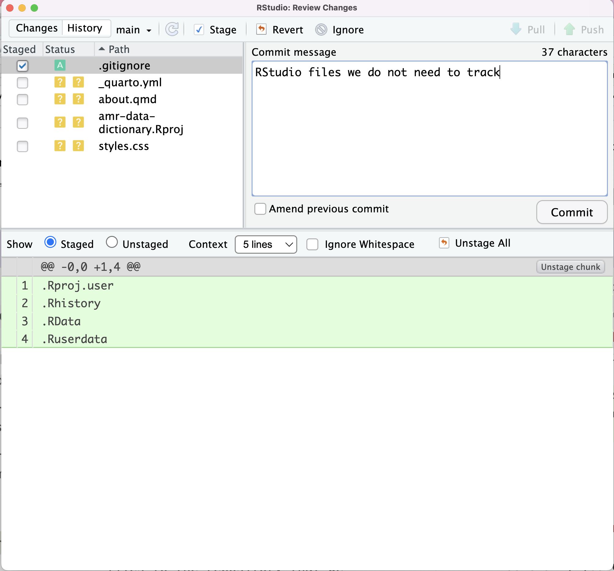
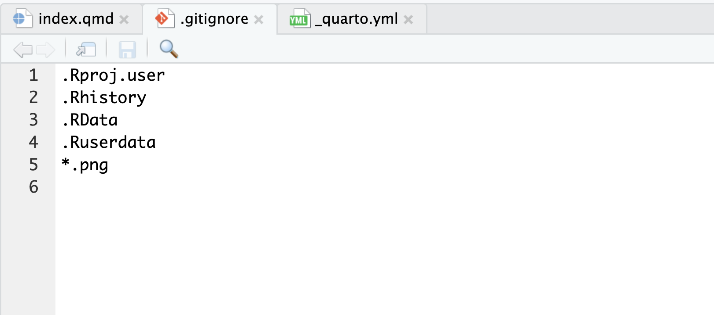
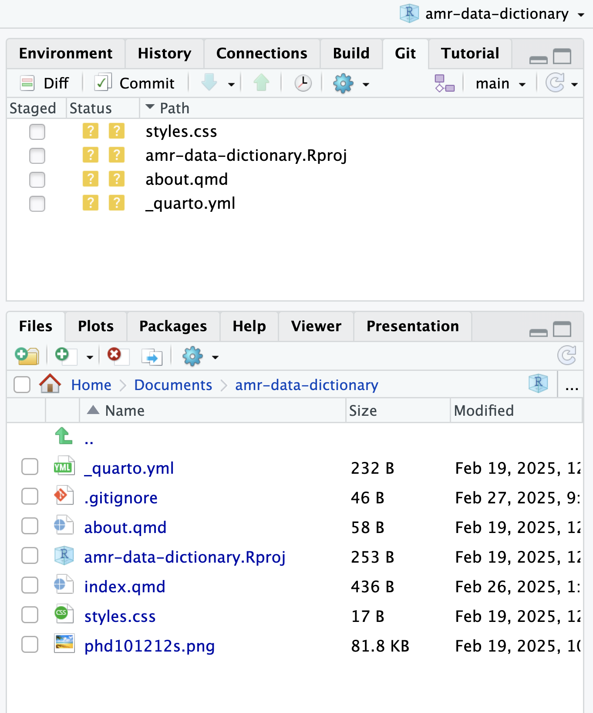

::::::::::::::::::::::::::::::::::::::: objectives

- Configure Git to ignore specific files.
- Explain why ignoring files can be useful.

::::::::::::::::::::::::::::::::::::::::::::::::::

:::::::::::::::::::::::::::::::::::::::: questions

- How can I tell Git to ignore files I don't want to track?

::::::::::::::::::::::::::::::::::::::::::::::::::

RStudio creates a number of files that it uses to keep track of a project.

Putting these files under version control would be a waste of disk space.
What's worse,
having them all listed could distract us from changes that actually matter,
so let's tell Git to ignore them.

In our files list notice that we have a `.gitignore`
file.

This was automatically created when we setup specified that we wanted to create a project with a Git repository.

Let's take a look at the file:

{alt='RStudio screenshot showing .gitignore open in the editor pane with the files .Rproj.user, .Rhistory, .RData, and \*.Rproj added to the end'}

These patterns tell Git to ignore some specific files and any file whose name ends in `.Rproj`.
(If any of these files were already being tracked,
Git would continue to track them.)

You might think we wouldn't want to track it,
but everyone we're sharing our repository with will probably want to ignore
the same things that we're ignoring.
Let's add and commit `.gitignore`:

{alt='RStudio screenshot showing .gitignore commit text'}

:::::::::::::::::::::::::::::::::::::::::  callout

## Tip: versioning disposable output

Generally you do not want to version control disposable output (or read-only
data). You should modify the `.gitignore` file to tell Git to ignore these
files and directories.


::::::::::::::::::::::::::::::::::::::::::::::::::

As a bonus, using `.gitignore` helps us avoid accidentally adding files to the repository that we don't want to track.

It is likely that we will generate a range of plots during our analysis that we may not want to track. We can expand our `.gitignore` to ignore any `.png` files and commit our changes.

{alt='RStudio screenshot showing that the expansion of .gitignore to ignore .png files.'}

I have added a `.png` file to the `amr-data-dictionary` directory. Notice that it does not appear in our Git tab files list.

{alt='RStudio screenshot showing that the .png file has been ignored.'}

We can try to add the file via the `Terminal`, Git will let us know that we have chosen not to track the file:

```bash
git add phd101212s.png
```
```output
The following paths are ignored by one of your .gitignore files:
phd101212s.png
hint: Use -f if you really want to add them.
hint: Turn this message off by running
hint: "git config advice.addIgnoredFile false"
```
You will notice from the output that it is possible to bypass the `.gitignore` file but it is not generally recommended.


:::::::::::::::::::::::::::::::::::::::  challenge

## Challenge

1. Create a new directory within your project called `graphs`.
2. Modify the `.gitignore` so that the `graphs` directory is not version controlled.

:::::::::::::::  solution

## Solution to Challenge

This can be done in Rstudio:

```r
dir.create("./graphs")
```

Then open up the `.gitignore` file from the right-hand panel of Rstudio and add
`graphs/` to the list of files to ignore.

:::::::::::::::::::::::::

::::::::::::::::::::::::::::::::::::::::::::::::::

:::::::::::::::::::::::::::::::::::::::  challenge

## Ignoring Nested Files

Given a directory structure that looks like:

```bash
analysis/data
analysis/plots
```

How would you ignore only `analysis/plots` and not `analysis/data`?

:::::::::::::::  solution

## Solution

If you only want to ignore the contents of
`analysis/plots`, you can change your `.gitignore` to ignore
only the `/plots/` subfolder by adding the following line to
your .gitignore:

```output
analysis/plots/
```

This line will ensure only the contents of `analysis/plots` is ignored, and
not the contents of `analysis/data`.

As with most programming issues, there
are a few alternative ways that one may ensure this ignore rule is followed.
The "Ignoring Nested Files: Variation" exercise has a slightly
different directory structure
that presents an alternative solution.
Further, the discussion page has more detail on ignore rules.


:::::::::::::::::::::::::

::::::::::::::::::::::::::::::::::::::::::::::::::

:::::::::::::::::::::::::::::::::::::::  challenge

## Including Specific Files

How would you ignore all `.png` files in your root directory except for
`final.png`?
Hint: Find out what `!` (the exclamation point operator) does

:::::::::::::::  solution

## Solution

You would add the following two lines to your .gitignore:

```output
*.png           # ignore all png files
!final.png      # except final.png
```

The exclamation point operator will include a previously excluded entry.

Note also that because you've previously committed `.png` files in this
lesson they will not be ignored with this new rule. Only future additions
of `.png` files added to the root directory will be ignored.


:::::::::::::::::::::::::

::::::::::::::::::::::::::::::::::::::::::::::::::


:::::::::::::::::::::::::::::::::::::::  challenge

## Ignoring all data Files in a Directory

Assuming you have an empty .gitignore file, and given a directory structure that looks like:

```bash
receipts/data/market_position/gps/a.dat
receipts/data/market_position/gps/b.dat
receipts/data/market_position/gps/c.dat
receipts/data/market_position/gps/info.txt
receipts/plots
```

What's the shortest `.gitignore` rule you could write to ignore all `.dat`
files in `result/data/market_position/gps`? Do not ignore the `info.txt`.

:::::::::::::::  solution

## Solution

Appending `receipts/data/market_position/gps/*.dat` will match every file in `receipts/data/market_position/gps`
that ends with `.dat`.
The file `receipts/data/market_position/gps/info.txt` will not be ignored.


:::::::::::::::::::::::::

::::::::::::::::::::::::::::::::::::::::::::::::::

:::::::::::::::::::::::::::::::::::::::  challenge

## Ignoring all data Files in the repository

Let us assume you have many `.csv` files in different subdirectories of your repository.
For example, you might have:

```bash
results/a.csv
data/experiment_1/b.csv
data/experiment_2/c.csv
data/experiment_2/variation_1/d.csv
```

How do you ignore all the `.csv` files, without explicitly listing the names of the corresponding folders?

:::::::::::::::  solution

## Solution

In the `.gitignore` file, write:

```output
**/*.csv
```

This will ignore all the `.csv` files, regardless of their position in the directory tree.
You can still include some specific exception with the exclamation point operator.


:::::::::::::::::::::::::

::::::::::::::::::::::::::::::::::::::::::::::::::

:::::::::::::::::::::::::::::::::::::::  challenge

## The Order of Rules

Given a `.gitignore` file with the following contents:

```bash
*.csv
!*.csv
```

What will be the result?

:::::::::::::::  solution

## Solution

The `!` modifier will negate an entry from a previously defined ignore pattern.
Because the `!*.csv` entry negates all of the previous `.csv` files in the `.gitignore`,
none of them will be ignored, and all `.csv` files will be tracked.

:::::::::::::::::::::::::

::::::::::::::::::::::::::::::::::::::::::::::::::

:::::::::::::::::::::::::::::::::::::::  challenge

## Log Files

You wrote a script that creates many intermediate log-files of the form `log_01`, `log_02`, `log_03`, etc.
You want to keep them but you do not want to track them through `git`.

1. Write **one** `.gitignore` entry that excludes files of the form `log_01`, `log_02`, etc.

2. Test your "ignore pattern" by creating some dummy files of the form `log_01`, etc.

3. You find that the file `log_01` is very important after all, add it to the tracked files without changing the `.gitignore` again.

4. Discuss with your neighbor what other types of files could reside in your directory that you do not want to track and thus would exclude via `.gitignore`.

:::::::::::::::  solution

## Solution

1. append either `log_*`  or  `log*`  as a new entry in your .gitignore
2. track `log_01` using   `git add -f log_01`
  
  

:::::::::::::::::::::::::

::::::::::::::::::::::::::::::::::::::::::::::::::

:::::::::::::::::::::::::::::::::::::::: keypoints

- The `.gitignore` file tells Git what files to ignore.

::::::::::::::::::::::::::::::::::::::::::::::::::


