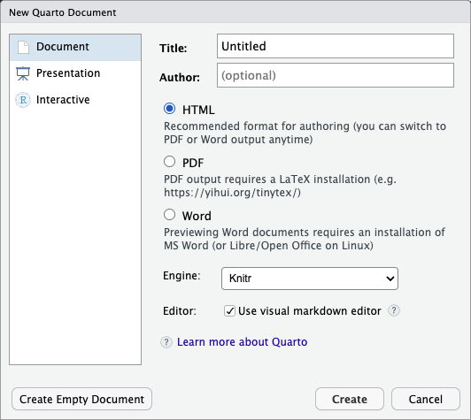

::::::::::::::::::::::::::::::::::::::: objectives

- Understand the value of writing reproducible reports
- Learn how to recognise and compile the basic components of an Quarto file
- Become familiar with R code chunks, and understand their purpose, structure and options
- Demonstrate the use of inline chunks for weaving R outputs into text blocks, for example when discussing the results of some calculations
- Be aware of alternative output formats to which a Quarto file can be exported

::::::::::::::::::::::::::::::::::::::::::::::::::

:::::::::::::::::::::::::::::::::::::::: questions

- How can I integrate software and reports?

::::::::::::::::::::::::::::::::::::::::::::::::::

```{r chunk_options, include=FALSE}
```

## Data analysis reports

Data analysts tend to write a lot of reports, describing their
analyses and results, for their collaborators or to document their
work for future reference.

Many new users begin by first writing a single R script containing all of their
work, and then share the analysis by emailing the script and various graphs
as attachments. But this can be cumbersome, requiring a lengthy discussion to
explain which attachment was which result.

Writing formal reports with Word or [LaTeX](https://www.latex-project.org/)
can simplify this process by incorporating both the analysis report and output graphs
into a single document. But tweaking formatting to make figures look correct
and fixing obnoxious page breaks can be tedious and lead to a lengthy "whack-a-mole"
game of fixing new mistakes resulting from a single formatting change.

Creating a report as a web page (which is an html file) using [Quarto](https://quarto.org/docs/get-started/hello/rstudio.html)
makes things easier.
The report can be one long stream, so tall figures that wouldn't ordinarily fit on
one page can be kept at full size and easier to read, since the reader can simply
keep scrolling. Additionally, the formatting of a Quarto document is simple and easy to modify,
allowing you to spend more time on your analyses instead of writing reports.

::: callout
You might also have heard about [R Markdown](https://rmarkdown.rstudio.com/) as a literate
programming tool. In a lot of ways, Quarto is the
[next-generation version of R Markdown](https://quarto.org/docs/faq/rmarkdown.html)
with more advanced features and multi-language support. However, at its core, Quarto still
works the same as R Markdown when it comes to R-based documents and R Markdown files (`.Rmd`)
are still compatible with Quarto. Much of what we cover in this episode is thus also valid
for traditional R Markdown files.
:::


## Literate programming

Ideally, such analysis reports are *reproducible* documents: If an
error is discovered, or if some additional subjects are added to the
data, you can just re-compile the report and get the new or corrected
results rather than having to reconstruct figures, paste them into
a Word document, and hand-edit various detailed results.

The key R package here is [`knitr`](https://yihui.name/knitr/). It allows you
to create a document that is a mixture of text and chunks of
code. When the document is processed by `knitr`, chunks of code will
be executed, and graphs or other results will be inserted into the final document.

This sort of idea has been called "literate programming".

When rendering a document, `knitr` will execute the R code in each chunk and
creates a new markdown (`.md`) document, which will include both the regular text
and output from the executed code chunks. This markdown file is then converted to the final
output format with [pandoc](http://pandoc.org/). This whole process is handled for you
by the *Render* button in the RStudio IDE.

## Creating a Quarto document

Within RStudio, click `File → New File → Quarto document...` and
you'll get a dialog box like this:

{alt='Screenshot of the New Quarto Document dialogue box in RStudio'}

You can stick with the default (HTML output), but give it a title.

## Basic components of R Markdown

The initial chunk of text (header) contains instructions for Quarto to specify what kind of document will be created, and the options chosen. You can use the header to give your document a title, author, date, and tell it what type of output you want
to produce. In this case, we're creating an `html` document.

```yaml
---
title: "My Quarto document"
author: "John Doe"
format: html
editor: visual
---
```

You can delete any of those fields if you don't want them
included. The double-quotes aren't strictly *necessary* in this case.
They're mostly needed if you want to include a colon in the title.

RStudio creates the document with some example text to get you
started. Note below that there are chunks like

````{verbatim}
```{r}
1 + 1
```
````

These are chunks of R code that will be executed by `knitr` and replaced
by their results. More on this later.

## Markdown

Markdown is a system for writing web pages by marking up the text much
as you would in an email rather than writing html code. The marked-up
text gets *converted* to html, replacing the marks with the proper
html code.

For now, let's delete all of the stuff that's there and write a bit of
markdown.

You make things **bold** using two asterisks, like this: `**bold**`,
and you make things *italics* by using underscores, like this:
`_italics_`.

You can make a bulleted list by writing a list with hyphens or
asterisks with a space between the list and other text, like this:

```markdown
A list:

* bold with double-asterisks
* italics with underscores
* code-type font with backticks
```

or like this:

```markdown
A second list:

- bold with double-asterisks
- italics with underscores
- code-type font with backticks
```

Each will appear as:

- bold with double-asterisks
- italics with underscores
- code-type font with backticks

You can use whatever method you prefer, but *be consistent*. This maintains the
readability of your code.

You can make a numbered list by just using numbers. You can even use the
same number over and over if you want:

```markdown
1. bold with double-asterisks
1. italics with underscores
1. code-type font with backticks
```

This will appear as:

1. bold with double-asterisks
2. italics with underscores
3. code-type font with backticks

You can make section headers of different sizes by initiating a line
with some number of `#` symbols:

```markdown
# Title

## Main section

### Sub-section

#### Sub-sub section
```

You *compile* the R Markdown document to an html webpage by clicking
the "Render" button in the upper-left. Or using the keyboard shortcut
<kbd>Shift</kbd>\+<kbd>Ctrl</kbd>\+<kbd>K</kbd> on Windows and Linux,
or <kbd>Shift</kbd>\+<kbd>Cmd</kbd>\+<kbd>K</kbd> on Mac.

:::::::::::::::::::::::::::::::::::::::  challenge

## Challenge 1

Create a new Quarto document. Delete all of the R code chunks
and write a bit of Markdown (some sections, some italicized
text, and an itemized list).

Convert the document to a webpage.

:::::::::::::::  solution

## Solution to Challenge 1

In RStudio, select `File > New file > Quarto Document...`

Delete the placeholder text and add the following:

```markdown
# Introduction

## Background on Data

This report uses the *gapminder* dataset, which has columns that include:

* country
* continent
* year
* lifeExp
* pop
* gdpPercap

## Background on Methods

```

Then click the 'Render' button on the toolbar to generate an html document (webpage).


:::::::::::::::::::::::::

::::::::::::::::::::::::::::::::::::::::::::::::::

## A bit more Markdown

You can make a hyperlink like this:
`[Carpentries Home Page](https://carpentries.org/)`.

You can include an image file like this: ``

You can do subscripts (e.g., F~2~) with `F~2~` and superscripts (e.g.,
F^2^) with `F^2^`.

If you know how to write equations in
[LaTeX](https://www.latex-project.org/), you can use `$ $` and `$$ $$` to insert math equations, like
`$E = mc^2$` and

```
$$y = \mu + \sum_{i=1}^p \beta_i x_i + \epsilon$$
```

which will show as

$$y = \mu + \sum_{i=1}^p \beta_i x_i + \epsilon$$


You can review Markdown syntax by navigating to the
"Markdown Quick Reference" under the "Help" field in the
toolbar at the top of RStudio.

## R code chunks

The real power of Quarto comes from
mixing markdown with chunks of code. When
processed, the R code will be executed; if they produce figures, the
figures will be inserted in the final document.

The main code chunks look like this:

````{verbatim}
```{r}
#| label: load_data
gapminder <- read.csv("gapminder.csv")
```
````

That is, you place a chunk of R code between <code>\`\`\`{r}</code>
and <code>\`\`\`</code>. You should give each chunk
a unique name, by inserting the line `#| label: label_name`
as they will help you to fix errors and, if any graphs are
produced, the file names are based on the name of the code chunk that
produced them. You can create code chunks quickly in RStudio using the shortcuts
<kbd>Ctrl</kbd>\+<kbd>Alt</kbd>\+<kbd>I</kbd> on Windows and Linux,
or <kbd>Cmd</kbd>\+<kbd>Option</kbd>\+<kbd>I</kbd> on Mac.

::: spoiler
### Code chunk options in R Markdown
In R Markdown, you add chunk labels by including them within the <code>\`\`\`{r}</code> line like so:

````{verbatim}
```{r label_data}
gapminder <- read.csv("gapminder.csv")
```
````
:::

:::::::::::::::::::::::::::::::::::::::  challenge

## Challenge 2

Add code chunks to:

- Load the ggplot2 package
- Read the gapminder data
- Create a plot

:::::::::::::::  solution

## Solution to Challenge 2

````{verbatim}
```{r}
#| label: libraries
library(ggplot2)
```
````

````{verbatim}
```{r}
#| label: load-gapminder-data
gapminder <- read.csv("gapminder.csv")
```
````

````{verbatim}
```{r}
#| label: make-plot
plot(lifeExp ~ year, data = gapminder)
```
````
:::::::::::::::::::::::::

::::::::::::::::::::::::::::::::::::::::::::::::::

## How things get compiled

When you press the "Render" button, the Quarto document is
processed by [`knitr`](https://yihui.name/knitr) and a plain Markdown
document is produced (as well as, potentially, a set of figure files): the R code is executed
and replaced by both the input and the output; if figures are
produced, links to those figures are included.

The Markdown and figure documents are then processed by the tool
[`pandoc`](https://pandoc.org/), which converts the Markdown file into an
html file, with the figures embedded.

{alt='Schematic of the Quarto rendering process'}

## Chunk options

There are a variety of options to affect how the code chunks are
treated. Here are some examples:

- Use `echo=FALSE` to avoid having the code itself shown.
- Use `results="hide"` to avoid having any results printed.
- Use `eval=FALSE` to have the code shown but not evaluated.
- Use `warning=FALSE` and `message=FALSE` to hide any warnings or
  messages produced.
- Use `fig.height` and `fig.width` to control the size of the figures
  produced (in inches).

So you might write:

````{verbatim}
```{r}
#| label: load_libraries
#| echo: false
#| message: false
library(dplyr)
library(ggplot2)
```
````

Often there will be particular options that you'll want to use
repeatedly; for this, you can set *global* chunk options in the files YAML header like so:

```yaml
---
...
knitr:
  opts_chunk:
    message: false
    warning: false
    echo: false
    results: "hide"
    fig.path: "Figs/
    fig.width: 11
---
```

The `fig.path` option defines where the figures will be saved. The `/`
here is really important; without it, the figures would be saved in
the standard place but just with names that begin with `Figs`.

If you have multiple R Markdown files in a common directory, you might
want to use `fig.path` to define separate prefixes for the figure file
names, like `fig.path="Figs/cleaning-"` and `fig.path="Figs/analysis-"`.

:::::::::::::::::::::::::::::::::::::::  challenge

## Challenge 3

Use chunk options to control the size of a figure and to hide the
code.

:::::::::::::::  solution

## Solution to Challenge 3

````{verbatim}
```{r}
#| label: faitful-plot
#| echo: false
#| fig.width: 3
plot(faitful)
```
````
:::::::::::::::::::::::::

::::::::::::::::::::::::::::::::::::::::::::::::::

You can review all of the `R` chunk options by navigating to
the "R Markdown Cheat Sheet" under the "Cheatsheets" section
of the "Help" field in the toolbar at the top of RStudio.

## Inline R code

You can make *every* number in your report reproducible. Use
<code>\`r</code> and <code>\`</code> for an in-line code chunk,
like so: ``` ``r "r round(some_value, 2)"`` ```. The code will be
executed and replaced with the *value* of the result.

Don't let these in-line chunks get split across lines.

Perhaps precede the paragraph with a larger code chunk that does
calculations and defines variables, with `include=FALSE` for that larger
chunk (which is the same as `echo=FALSE` and `results="hide"`).

:::::::::::::::::::::::::::::::::::::::  challenge

## Challenge 4

Try out a bit of in-line R code.

:::::::::::::::  solution

## Solution to Challenge 4

Here's some inline code to determine that 2 + 2 = `r 2+2`:

```{verbatim}
Here's some inline code to determine that 2 + 2 = `r 2+2`:
```
:::::::::::::::::::::::::

::::::::::::::::::::::::::::::::::::::::::::::::::

## Other output options

You can also convert R Markdown to a PDF or a Word document.
Change the `format: ` field in the YAML header to `pdf` or `docx`.
For an overview of all the available output formats, see the
[Quarto documentation](https://quarto.org/docs/output-formats/all-formats.html)

## Parameterised reports

Literate programming with tools like Quarto and R Markdown is very powerful in
that it allows you to generate analysis reports in a reproducible manner.
This makes it very easy to update your work and alter the input parameters within the report
You can take this one step further, by parametrising the reports themselves.
This is very useful in a number of cases, for example:

* Running the same analysis on different datasets
* Generating multiple reports for different groups of the data (e.g. geographic location or time periods)
* Controlling the `knitr` options; e.g. you might want to show the code in some reports but not in others

### Including parameters in a Quarto document

Including parameters in a Quarto document (or R Markdown, which follows the same syntax) can be done
by adding the `params` field to they YAML header. This field can hold a list of multiple parameters.

For example, imagine we want to analyse the life expectancy of different countries, using the
`gapminder` dataset, but we want a separate report for each country. To achieve this, we set
the YAML header for our Quarto document as follows:

```yaml
---
title: "Life Expectancy Report"
format: html
execute:
  echo: false
  warning: false
  message: false
params:
  country: "Afghanistan"
---
```

We can then reference this parameter anywhere in the R code in our report by accessing the
`params` object. To calculate the life expectancy for just the country defined by the `params`,
we can do:

````{verbatim}
```{r}
library(tidyverse)
library(gapminder)
```

```{r}
life_expectancy <-
  gapminder |>
  select(country, year, lifeExp) |>
  filter(country == params$country)
```
````

The last line in the code chunk above uses the `params` object to filter the `gapminder` dataset.
Note that we can also `params` in inline R code snippets. So we can generate a heading that will
change based on the country parameter:

````{verbatim}
## Life Expectancy in `r params$country`

```{r}
#| label: !expr paste0("life-expectancy-plot", params$country)
ggplot(life_expectancy, aes(year, lifeExp)) +
  geom_line() +
  theme_minimal()
```
````

In fact, we can even use this in the main document title in the YAML header, as it also accepts
R code expressions:

```yaml
---
title: "Life Expectancy Report for `r params$country`"
...
```

### Rendering Quarto documents from within R

Of course, manually editing the YAML header every time you want to generate a report
isn't much better than manually editing the report itself. The real power of parameterised
reports is when we render them *programmatically*. This can be done using the
[`{quarto}` R package](https://github.com/quarto-dev/quarto-r), which provides
the `quarto_render()` function. This function takes a Quarto file and any execution parameters
as input.

So to generate the life expectancy report for Afghanistan, we can write a script with the following
code:

```r
# render-report.R
library(quarto)
quart_render("life_expectancy_report.qmd", execute_params = list(country = "Afghanistan"))
```

And now for the real magic, we can modify our script to render a report for a list of countries
of interest from the `gapminder` dataset.

```{r}
# render-all-reports.R
library(quarto)
countries <- c("Afghanistan", "Belgium", "India", "United Kingdom")
for (country in countries) {
  quarto_render(
    input = "life_expectancy_report.qmd",
    output_file = paste0("life_expectancy_", country, ".html"),
    execute_params = list(country = country)
  )
}
```

After running this script, we should have the following files in our working directory:

```
.
├── life_expectancy_Afghanistan.html
├── life_expectancy_Belgium.html
├── life_expectancy_India.html
├── life_expectancy_United Kingdom.html
├── life_expectancy_report.qmd
└── life_expectancy_report_files
```

::: callout
**WARNING**: although this will work and generate the correct output files,
you might notice that each report will show the _exact same plot_, which is unexpected.
This is an [issue](https://github.com/quarto-dev/quarto-r/issues/205) with the Quarto R package.

With R Markdown we don't have this issue, to render we would use the following code:

```r
rmarkdown::render(
  input = "life_expectency_report.Rmd",
  output_file = paste0("life_expectancy_", country, ".html"),
  params = list(country = country)
)
```

:::

:::::::::::::::::::::::::::::::::::::::::  callout

## Tip: Creating PDF documents

Creating .pdf documents may require installation of some extra software. The R
package `tinytex` provides some tools to help make this process easier for R users.
With `tinytex` installed, run `tinytex::install_tinytex()` to install the required
software (you'll only need to do this once) and then when you knit to pdf `tinytex`
will automatically detect and install any additional LaTeX packages that are needed to
produce the pdf document. Visit the [tinytex website](https://yihui.org/tinytex/)
for more information.

::::::::::::::::::::::::::::::::::::::::::::::::::

:::::::::::::::::::::::::::::::::::::::::  callout

## Tip: Visual markdown editing in RStudio

RStudio versions 1.4 and later include visual markdown editing mode.
In visual editing mode, markdown expressions (like `**bold words**`) are
transformed to the formatted appearance (**bold words**) as you type.
This mode also includes a toolbar at the top with basic formatting buttons,
similar to what you might see in common word processing software programs.
You can turn visual editing on and off by pressing
the {alt='Icon for turning on and off the visual editing mode in RStudio, which looks like a pair of compasses'}
button in the top right corner of your R Markdown document.

::::::::::::::::::::::::::::::::::::::::::::::::::

## Resources

- [Knitr in a knutshell tutorial](https://kbroman.org/knitr_knutshell)
- [Dynamic Documents with R and knitr](https://www.amazon.com/exec/obidos/ASIN/1482203537/7210-20) (book)
- [R Markdown documentation](https://rmarkdown.rstudio.com)
- [R Markdown cheat sheet](https://www.rstudio.com/wp-content/uploads/2016/03/rmarkdown-cheatsheet-2.0.pdf)
- [Getting started with R Markdown](https://www.rstudio.com/resources/webinars/getting-started-with-r-markdown/)
- [R Markdown: The Definitive Guide](https://bookdown.org/yihui/rmarkdown/) (book by Rstudio team)
- [Reproducible Reporting](https://www.rstudio.com/resources/webinars/reproducible-reporting/)
- [The Ecosystem of R Markdown](https://www.rstudio.com/resources/webinars/the-ecosystem-of-r-markdown/)
- [Introducing Bookdown](https://www.rstudio.com/resources/webinars/introducing-bookdown/)

:::::::::::::::::::::::::::::::::::::::: keypoints

- Mix reporting written in R Markdown with software written in R.
- Specify chunk options to control formatting.
- Use `knitr` to convert these documents into PDF and other formats.

::::::::::::::::::::::::::::::::::::::::::::::::::


